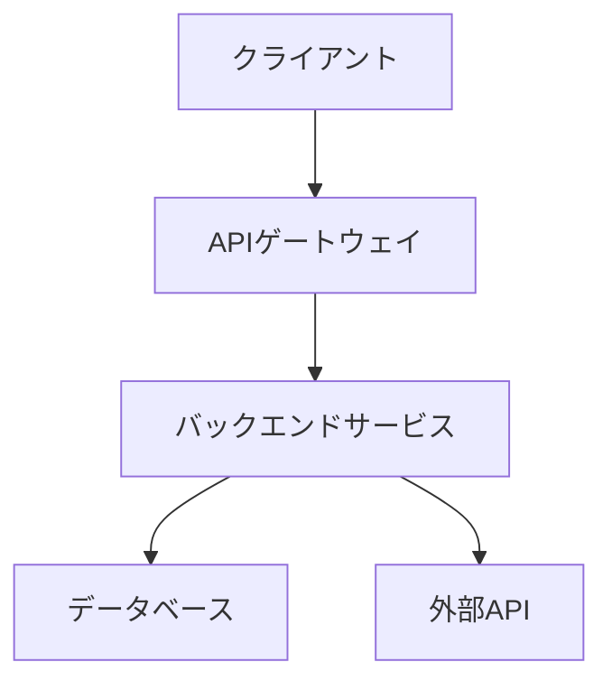
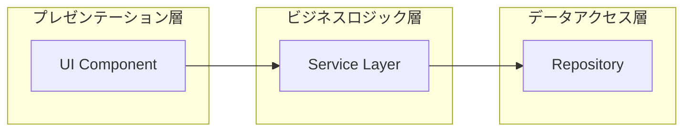
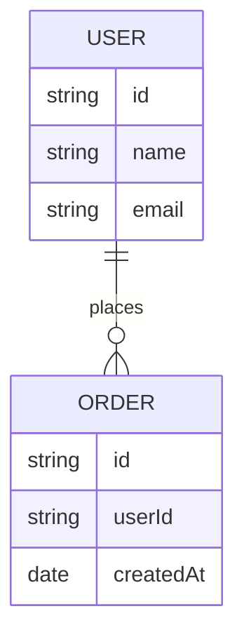

# my-microservices - アーキテクチャ設計書

## プロジェクト情報

- **プロジェクト名**: my-microservices
- **JIRAキー**: PC
- **Confluenceスペース**: MICHI
- **作成日時**: 2025-12-19T15:23:49.760Z

## システム構成図

<!-- システム構成図を更新してください -->

## アーキテクチャパターン

<!-- 採用するアーキテクチャパターンを記述してください -->
<!-- 例: マイクロサービス、レイヤードアーキテクチャ、ヘキサゴナルアーキテクチャ -->

### レイヤー構成

<!-- レイヤー構成を記述してください -->

## コンポーネント図

<!-- コンポーネント図を更新してください -->

## 技術スタック

### フロントエンド

<!-- フロントエンド技術スタックを記述してください -->

### バックエンド

<!-- バックエンド技術スタックを記述してください -->

### データベース

<!-- データベース技術スタックを記述してください -->

### インフラストラクチャ

<!-- インフラストラクチャを記述してください -->

## データモデル

<!-- データモデルを記述してください -->

## セキュリティアーキテクチャ

<!-- セキュリティアーキテクチャを記述してください -->

## スケーラビリティ設計

<!-- スケーラビリティ設計を記述してください -->

## 変更履歴

| 日付 | バージョン | 変更内容 | 担当者 |
|------|-----------|---------|--------|
| 2025-12-19T15:23:49.760Z | 1.0.0 | 初版作成 | - |
