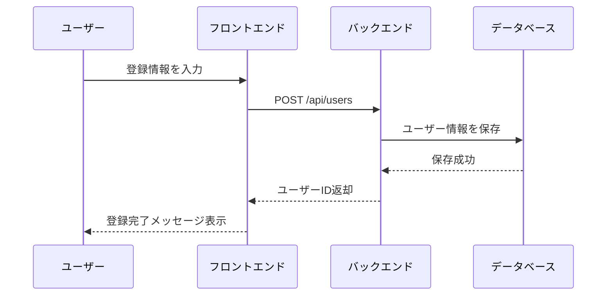
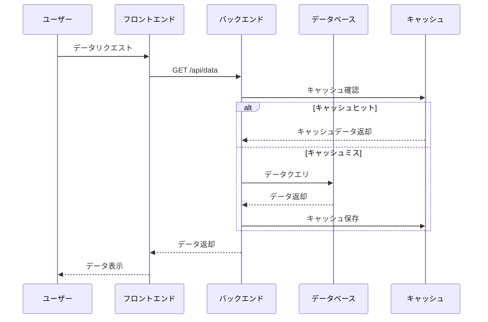
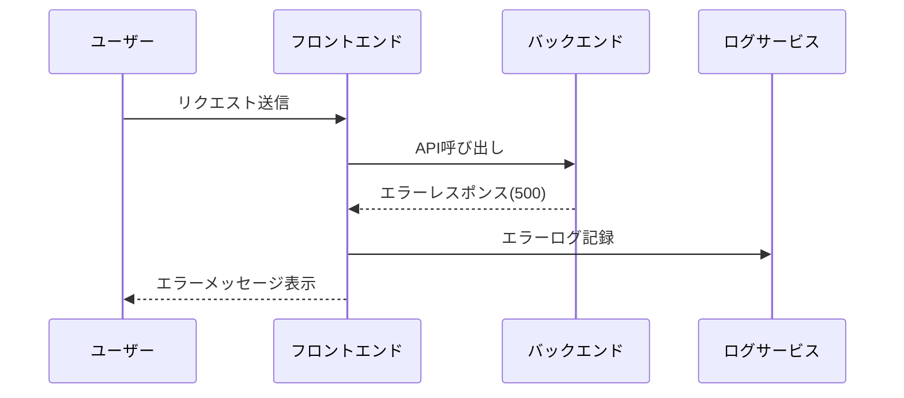

# my-microservices - シーケンス図

## プロジェクト情報

- **プロジェクト名**: my-microservices
- **JIRAキー**: PC
- **Confluenceスペース**: MICHI
- **作成日時**: 2025-12-19T15:23:49.760Z

## 主要フローのシーケンス図

### ユーザー登録フロー

<!-- ユーザー登録フローを更新してください -->

### データ取得フロー

<!-- データ取得フローを更新してください -->

### エラーハンドリングフロー

<!-- エラーハンドリングフローを更新してください -->

## 変更履歴

| 日付 | バージョン | 変更内容 | 担当者 |
|------|-----------|---------|--------|
| 2025-12-19T15:23:49.760Z | 1.0.0 | 初版作成 | - |
